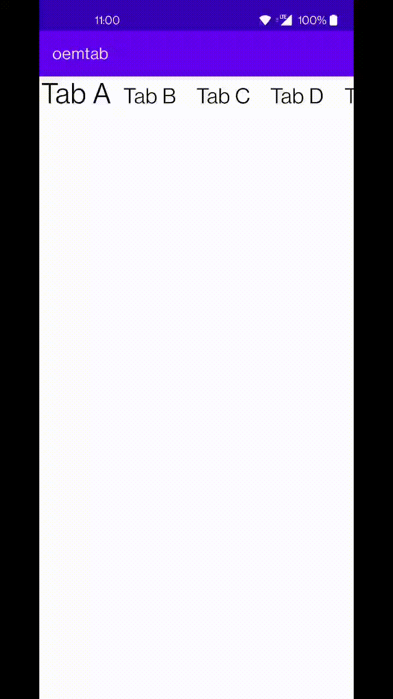

# NTabLayout

[](https://jitpack.io/#GinRyan/NTabLayout)

## Brief

NTabLayout is a simple tab bar custom view under android which has click-sliding and scaling up animation effect.

This tab bar's effect seems like Xue Qiu's tab bar,  which can load tags on top of ViewPager and there's a  click-sliding effect and scaling up animation.


## SnapShot



## Usage

Add into project:

```groovy
repositories {
    maven { url "https://jitpack.io" }
}
```

and add line:

```groovy
implementation 'com.github.GinRyan:NTabLayout:0.3.4'
```


layout.xml

```xml
   <org.ginryan.github.slidingtab.NTabLayout
        android:id="@+id/tablayout"
        android:layout_width="match_parent"
        android:layout_height="wrap_content"
        app:nTabUseAnimationFontScale="true">

        <org.ginryan.github.slidingtab.NTabView
            android:id="@+id/tabviewA"
            android:layout_width="90dp"
            android:layout_height="40dp"
            app:nTabTitleChecked="true"
            app:nTabTitleSize="26sp"
            app:nTabTitleText="Tab A" />
       ...
   </org.ginryan.github.slidingtab.NTabLayout>
```

NTabLayout have to include one or more NTabView to show tabs.


### Attributes 

| CustomView | attr name                 | introduction                                                 |
| ---------- | ------------------------- | ------------------------------------------------------------ |
| NTabLayout | nTabUseAnimationFontScale | Once this `nTabUseAnimationFontScale` attribute was set true, this will enable animation when switch tabs, or there will not be tween animation. |
| NTabView   | nTabTitleChecked          | Default check status. When set true, this tab will  emphasize and scale up in default. |
| NTabView   | nTabTitleText             | Tab's text content.                                          |
| NTabView   | nTabTitleSize             | Tab's text size .                                            |
| NTabView   | nTabTitleColor            | Tab's text color.                                            |


### Code

| Class      | method                    | introduction                                                 |
| ---------- | ------------------------- | ------------------------------------------------------------ |
| NTabLayout | setSelectedTab(int index) | select tab.                                                  |
| NTabLayout | addOnTabListener          | on tab select listener. When tab is selected by hand,it will call `OnTabListener.onTabItemSelected(int itemIndex)` to tell observer which tab is selected. |
|            |                           |                                                              |

Usage:

setSelectedTab
```java
NTabLayout tablayout = findViewById(...);
tablayout.setSelectedTab(0);
```

addOnTabListener
```java
NTabLayout tablayout = findViewById(...);

tablayout.addOnTabListener(itemIndex -> {
    Log.d("Tab","Selected Tab: " + itemIndex);
});
```

Interact with ViewPager: 

```java
ViewPager viewPager = findViewById(...);
NTabLayout tablayout = findViewById(...);

viewPager.addOnPageChangeListener(new ViewPager.OnPageChangeListener() {
            @Override
            public void onPageScrolled(int position, float positionOffset, int positionOffsetPixels) {
				//Causion!You can't not pull here.
            }

            @Override
            public void onPageSelected(int position) {
                tablayout.setSelectedTab(position);
            }

            @Override
            public void onPageScrollStateChanged(int state) {
            }
        });
tablayout.addOnTabListener(itemIndex -> {
            viewPager.setCurrentItem(itemIndex);
});

```

## Third Party Library

Sources need no 3rd party dependencies. 


But aapt need appcompat deps to build resources.


## License

```
Copyright 2021 GinRyan

Licensed under the Apache License, Version 2.0 (the "License");
you may not use this file except in compliance with the License.
You may obtain a copy of the License at

   http://www.apache.org/licenses/LICENSE-2.0

Unless required by applicable law or agreed to in writing, software
distributed under the License is distributed on an "AS IS" BASIS,
WITHOUT WARRANTIES OR CONDITIONS OF ANY KIND, either express or implied.
See the License for the specific language governing permissions and
limitations under the License.
```

